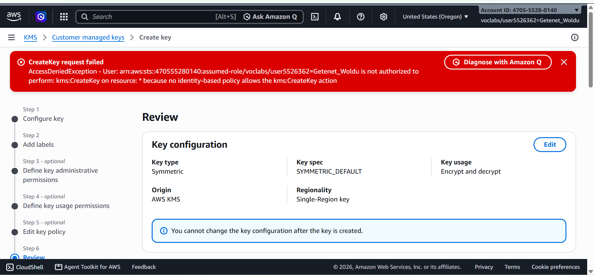
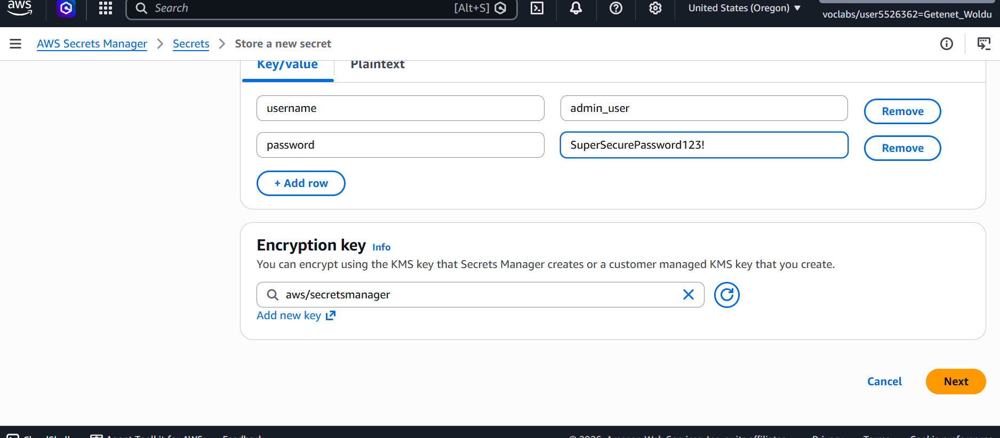

# AWS KMS & Secrets Management & Security Boundaries Lab

## Project Overview
Designed and implemented an enterprise-grade data protection framework using AWS Key Management Service (KMS) and AWS Secrets Manager, while evaluating security guardrails and IAM permission boundaries in a restricted sandbox environment.

---

## Architecture & Security Controls Implemented
* **Customer Managed Keys (CMKs) vs. AWS-Managed Keys:** Analyzed encryption key hierarchies. Encountered sandbox Service Control Policy (SCP) restrictions (`kms:CreateKey` and `secretsmanager:CreateSecret` access denied), highlighting the importance of least-privilege identity boundaries and organizational guardrails.
* **Secrets Lifecycle Management Strategy:** Architected a secure model for storing database credentials (`prod/database/credentials`) using encryption-at-rest defaults to eliminate hardcoded credentials in source code.
* **Security Boundary Handling:** Documented how cloud security engineers handle explicit permission denials by leveraging pre-configured AWS-managed infrastructure and alternative parameter stores.

---

## Implementation Screenshots

### 1. KMS Key Configuration & Sandbox Policy Evaluation
*Attempted to configure a Customer Managed Key (CMK) with symmetric encryption, revealing organizational IAM boundary restrictions:*

### 2. Secrets Manager Setup & Parameter Design
*Configured encrypted key/value pairs for database credentials protected by AWS-managed default encryption:*

