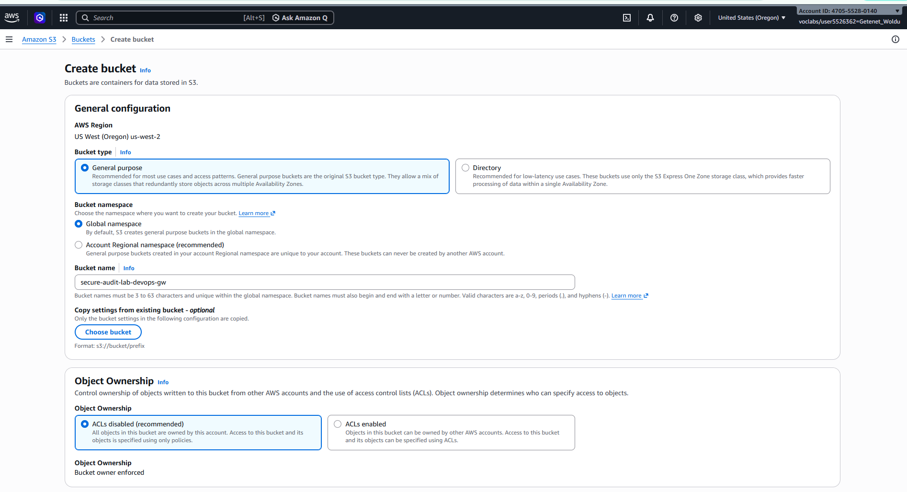

# AWS S3 Security & Data Protection Audit Lab

## Project Overview
Configured an enterprise-grade secure Amazon S3 storage bucket enforcing strict data privacy, versioning, default server-side encryption, and secure transport policies within an AWS sandbox environment.

---

## Architecture & Security Controls Implemented

* **Block Public Access:** Enabled all four public access blocks to ensure zero risk of accidental public data exposure.
* **Bucket Versioning:** Enabled object versioning to protect against accidental object overwrites or deletions.
* **Default Encryption:** Applied Server-Side Encryption with S3 Managed Keys (SSE-S3) for data at rest.
* **TLS Enforcement Policy:** Wrote a custom IAM bucket policy explicitly denying unencrypted HTTP requests (`aws:SecureTransport: false`).

---

## Step-by-Step Implementation Proof

* Created an Amazon S3 general-purpose storage bucket named `secure-audit-lab-devops-gw` in the `us-west-2` region, configuring it with object ownership set to ACLs disabled (Bucket Owner Enforced) for modern IAM-based access control.



* Successfully implemented and verified a custom JSON bucket policy that enforces secure HTTPS transport (`aws:SecureTransport: false`) while maintaining strict public access blocks.


```json
{
    "Version": "2012-10-17",
    "Statement": [
        {
            "Sid": "EnforceHTTPSConnections",
            "Effect": "Deny",
            "Principal": "*",
            "Action": "s3:*",
            "Resource": [
                "arn:aws:s3:::secure-audit-lab-devops-gw",
                "arn:aws:s3:::secure-audit-lab-devops-gw/*"
            ],
            "Condition": {
                "Bool": {
                    "aws:SecureTransport": "false"
                }
            }
        }
    ]
}
