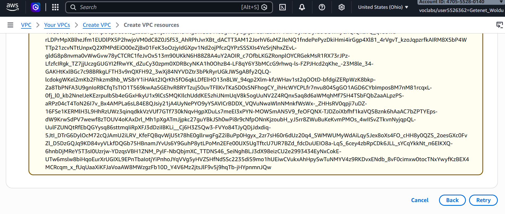
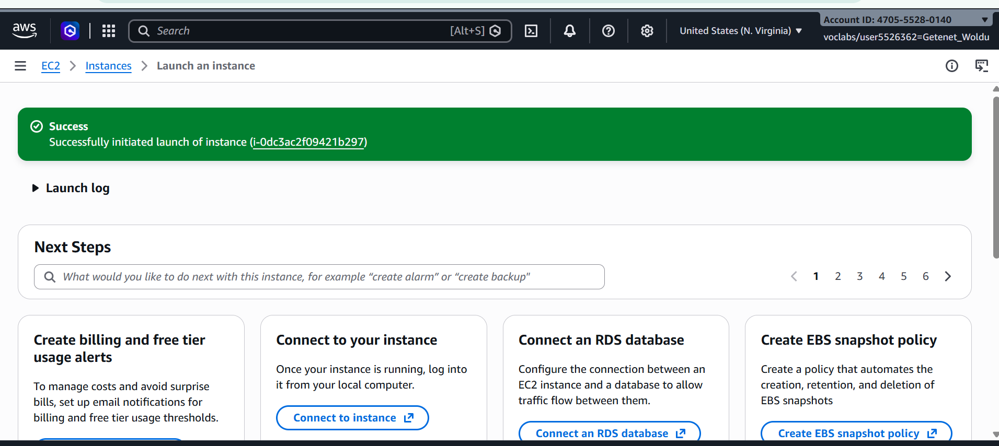

# AWS VPC Security & Network Hardening Lab

## Overview
This project focuses on enterprise network security, perimeter defense, and instance-level traffic filtering within AWS. It demonstrates the ability to enforce strict security boundaries and handle real-world cloud governance guardrails.

## Architecture & Security Controls
* **Network Boundary:** Utilized the AWS Default VPC with configured subnet isolation.
* **Instance Hardening:** Deployed an Amazon EC2 instance (`t3.micro`) running Amazon Linux.
* **Firewall Engineering:** Configured stateful **Security Groups** to enforce least-privilege network access, explicitly restricting inbound administrative ports.
* **Governance & Guardrails:** Documented and adapted to organizational Service Control Policies (SCPs) that restrict unauthorized `ec2:CreateVpc` actions, showcasing compliance-driven engineering.

## Implementation Roadmap & Evidence
1. **Sandbox & SCP Navigation:** Handled explicit organization-level denies on custom VPC creation by securing default network architecture.
   * **Evidence (SCP Guardrail Enforcement):**
   * 

2. **EC2 Deployment (`i-0dc3ac2f09421b297`):** Launched a secure, least-privilege instance in the N. Virginia (`us-east-1`) region.
   * **Evidence (Successful Instance Launch):**
   * 
